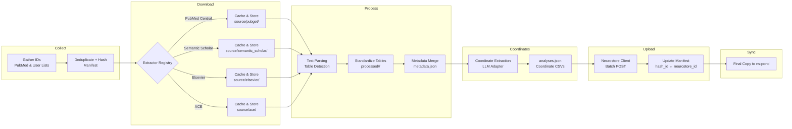

# Ingestion Workflow Package Plan

## Goals
- Provide a modular, CLI-driven workflow to ingest neuroimaging papers into Neurostore.
- Support multiple download extractors with consistent interfaces and local caching.
- Standardize processing of full text, tables, metadata, and coordinate extraction.
- Enable incremental runs with resumable manifests and final synchronization to `ns-pond`.

## Package Structure
- `cli.py` & `config.py` – command-line entry points and environment/config loading.
- `models/` – dataclasses describing identifiers, download artifacts, processed outputs, and Neurostore payloads.
- `pipeline/` – orchestration logic, state/manifest management, run reporting.
- `extractors/` – individual source clients (PubMed Central, Semantic Scholar, Elsevier, ACE) extending a shared `Extractor` ABC.
- `metadata/` – external metadata clients (Semantic Scholar, PubMed) with caching.
- `processors/` – text parsing, table detection, normalization, metadata merge routines.
- `llm/` – coordinate extraction abstraction for LLM providers.
- `storage/` – hashed workspace manager, caching helpers, staging/final sync utilities.
- `neurostore/` – REST client for batch uploads and ID reconciliation.
- `logging_utils/` – structured logging and progress reporting.

## Workflow Highlights
- **Identifier Gathering** – merge collector outputs, deduplicate by pmid/doi/pmcid, assign stable hash IDs, persist manifest.
- **Download Stage** – iterate extractors in configured priority; cache raw artifacts per `hash_id` and source; skip downstream extractors after success.
- **Processing Stage** – extract full text, detect coordinate tables, standardize tables, serialize raw and normalized outputs.
- **Metadata Merge** – query external metadata APIs with cached responses; consolidate with parsed metadata.
- **Coordinate Extraction** – run LLM-based parser on selected tables; produce standardized coordinate CSVs and `analyses.json`.
- **Upload Stage** – batch POST metadata and coordinates to Neurostore; record returned IDs.
- **Sync Stage** – mirror processed outputs and Neurostore IDs to `ns-pond`, supporting incremental updates and overwrites.

## Mermaid Overview

## CLI Considerations
- `ingest run` – execute full pipeline with optional `--resume`, `--limit`, `--force-download`.
- `ingest gather-ids`, `ingest download`, `ingest process`, `ingest upload`, `ingest sync-local` – modular subcommands for cron-style scheduling or manual reruns.
- Support `--dry-run`, structured logs, and run reports for monitoring.

## Extensibility Notes
- Extractor and metadata clients registered via configuration; new sources plug in without altering the orchestrator.
- Coordinate extraction module can swap LLM providers via configuration.
- Storage manager centralizes cache paths, enabling future remote storage backends.

## Implementation Notes (Current)
- Initial package scaffolding (`pyproject.toml`, `ingestion_workflow/` modules) established with abstract interfaces for extractors, metadata, processing, LLM, and Neurostore client.
- `StorageManager`, core data models, and manifest helpers implemented to support incremental runs.
- CLI (`ingest`) wired to orchestrator skeleton; stage-specific implementations remain placeholders for future development.
- PubMed gather stage implemented, allowing `ingest run --query "<term>"` to populate manifest identifiers via E-utilities.
- Pubget extractor implemented, reusing reference workflow to download PMC articles, filter coordinate tables via existing heuristics, and persist relevant artifacts plus manifests for coordinate-bearing tables.
